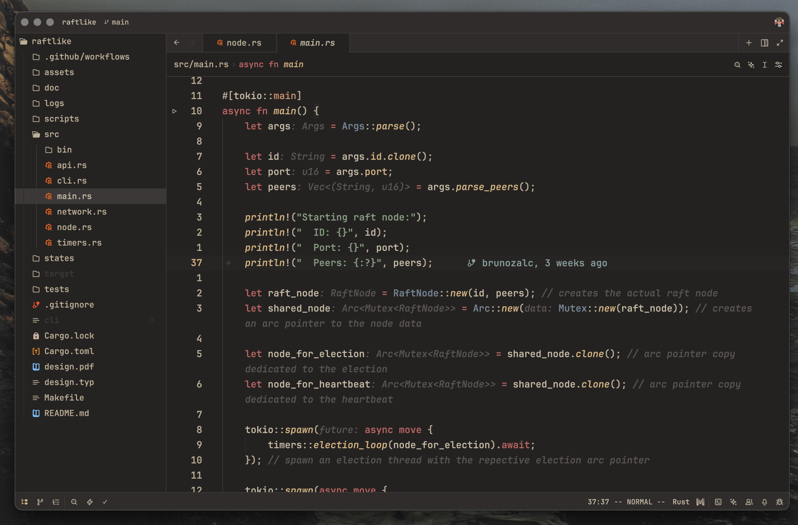
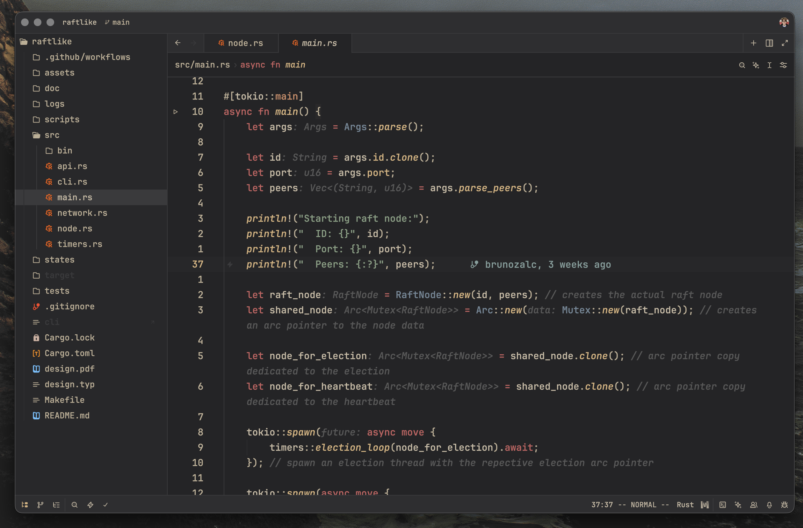
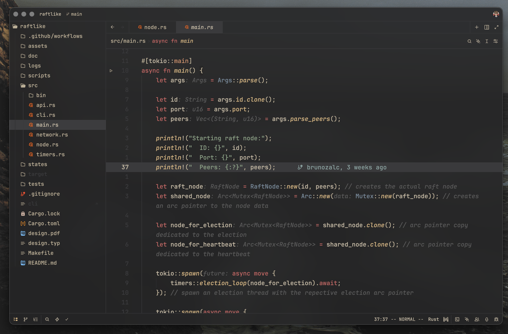

# zed-chocolate

Chocolate theme for Zed 🍫

## Description

This is a zed port of [snakedye's chocolate](https://gitlab.com/snakedye/chocolate) theme.

Currently, there is no light mode support.

This is my first theme. If you find any inconsistencies or have any suggestions, feel free to submit a PR!

## Preview

- **Chocolate Dark**:
  

- **Chocolate Dark (Blurred)**:
  

- **Gray Chocolate Dark**:
  

- **Gray Chocolate Dark (Blurred)**:
  

## Credit

All credit goes to [snakedye](https://gitlab.com/snakedye), the creator of this theme. I also took inspiration from many (neo)vim implementations of this scheme.
